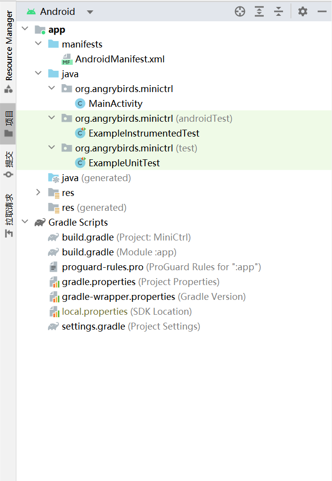

# smartEverything
智能，智能，智能

主要有三个文件夹
- MiniCtrl Android控制程序
- MicroPython ESP[micropython](https://github.com/micropython/micropython)代码
- PythonServer 服务端UDP转发服务器程序

## 使用方法(MiniCtrl)

### For Windows

注意：以下命令部分均在`Windows Terminal`或者`CMD`中完成

新建一个工作目录`mkdir <foldername>`

```powershell
mkdir ESP_Show
```

clone文件

```powershell
git clone https://github.com/gresces/smartEverything.git ./ESP_Show
```

出现类似下面的文字表示成功：
```git
PS E:\ESP_Show> git clone http://github.com/gresces/smartEverything.git ./
Cloning into '.'...
warning: redirecting to https://github.com/gresces/smartEverything.git/
remote: Enumerating objects: 106, done.
remote: Counting objects: 100% (106/106), done.
remote: Compressing objects: 100% (79/79), done.
remote: Total 106 (delta 6), reused 103 (delta 5), pack-reused 0
Receiving objects: 100% (106/106), 196.99 KiB | 566.00 KiB/s, done.
Resolving deltas: 100% (6/6), done.
```

打开安装好的AndroidStudio，点击`Open`，打开`..\ESP_Show\MiniCtrl`，等待右下角的文件安装好。



具体的修改可以参考网上的教程。

主要的两个文件为`AndroidManifest.xml`与`MainActivity.java`

签名打包生成Apk参看[Android程序签名打包](https://www.runoob.com/w3cnote/android-tutorial-sign-package.html).

关于本项目的一切，欢迎讨论